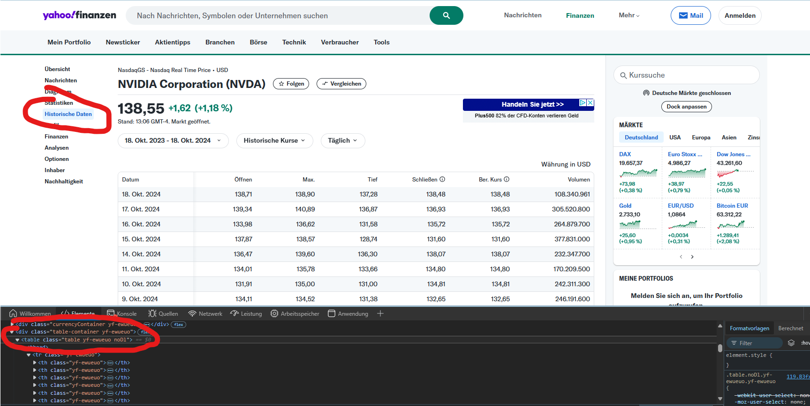

# Crawler für Yahoo Finance-Daten

## Daten beziehen

Historische Ansicht der Aktienkurse von Yahoo Finance beziehen. Beispiel für die Aktie von NVIDIA:
https://de.finance.yahoo.com/quote/NVDA/history/

Im Browser zur Entwickleransicht wechseln (meist mit F12). Alternativ mit rechter Maustaste auf die Tabelle mit den Kursdaten klicken und "Untersuchen" auswählen.



Im Elemente-Inspektor den HTML-Code der Tabelle (alles im Tag &lt;table&gt;, inkl. des table-Tags) kopieren und
mit einem Texteditor in die Datei ./data/table.html speichern.

## Daten umwandeln

### Vorbereitung

GIT-Repository klonen. Eine Konsole öffnen und ins Hauptverzeichnis des GIT-Repositories wechseln.

Danach eine virtuelle Python-Umgebung erstellen:

```bash
py -3.12 -m venv .venv
```

Im Anschluss die virtuelle Umgebung aktivieren:

```bash
.venv\Scripts\activate
```

Nun die benötigten Python-Bibliotheken installieren:

```bash
pip install -r requirements.txt
```

### Daten konertieren

Mit einer Konsole ins Verzeichnis `src` wechseln und das Skript `main.py` ausführen:

```bash
python main.py
```

Die Daten werden in das Verzeichnis `./data/output.csv` exportiert.

Bei Bedarf kann das Skript `main.py` angepasst werden, um bspw. Trennzeichen und Dezimalzeichen zu ändern.
